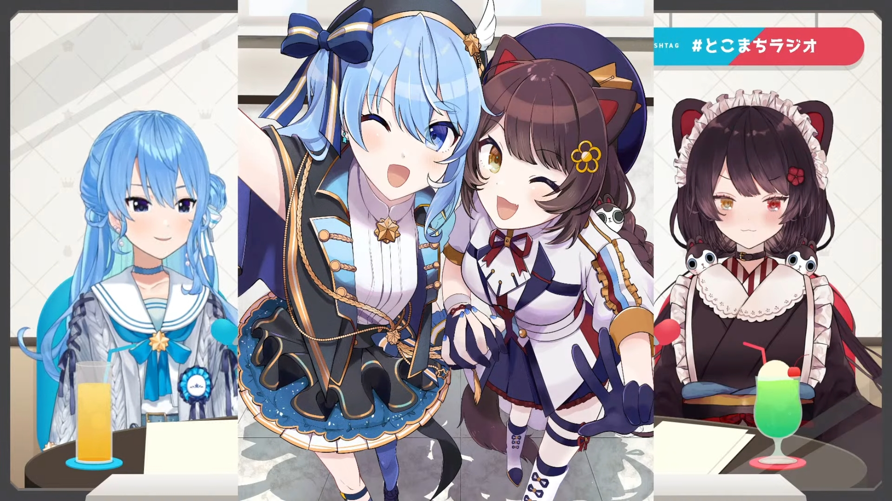
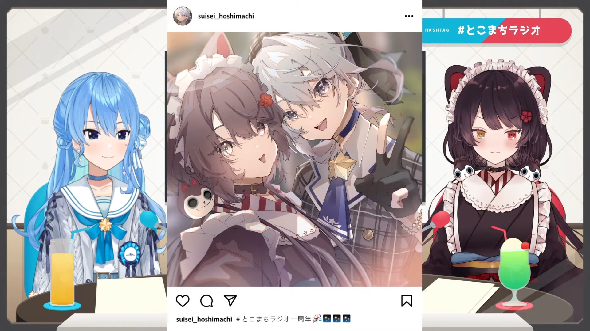
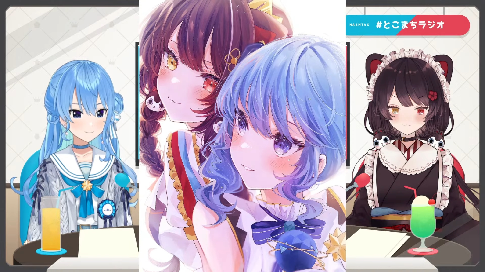
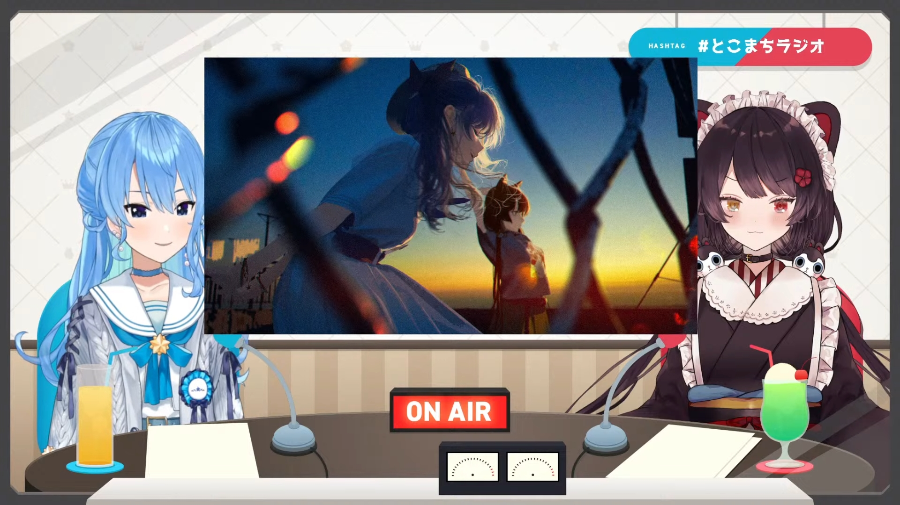
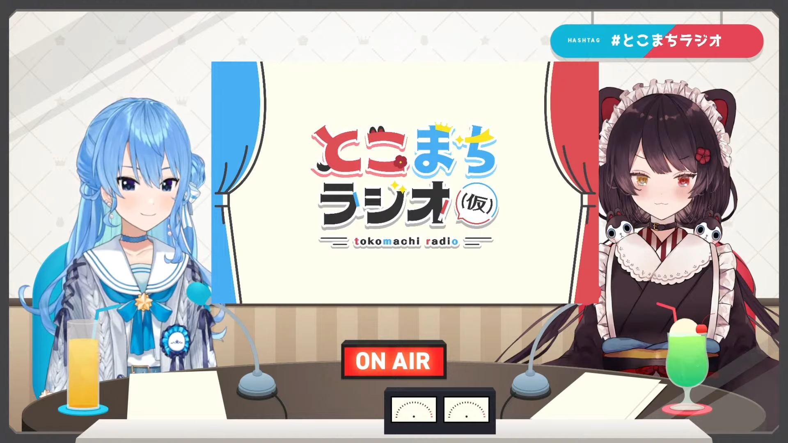

import YTTime from '@site/src/components/YTTime'
import YTLink from '@site/src/components/YTLink'
import SNSIcon from '@site/src/components/SNSIcon'
import FYI from '@site/src/components/FYI'
import Date from '@site/src/components/date'

# Episode 13: 1st Anniversary

<Date D="2021-10-31" />

> <YTLink Id="Ql5YkeQ6iDg" />

Tokomachi Radio celebrated the 1st Anniversary on 31st Oct.

Suisei said _Inui Toko_ when she should do her self-introduction.

The fan letters asked about when would they take (Temp) down and make the title formal since the radio program reached its first anniversary. But they agreed that (Temp) is already part of the formal title.

## Live After Talk

<FYI Topic="Stellar into the GALAXY" Desc="/topics/suisei_galaxy#after-talk" />

## Highlight of the Year

Suisei prepared some animated clips for the most funny scenes of the year

- [ <YTTime Id="Ql5YkeQ6iDg" Time="15:27" /> ] _Suisei making grated radish_, Toko love the scene so much that she asked Suisei to do that again and took a video, saved carefully in her phone.
- [ <YTTime Id="Ql5YkeQ6iDg" Time="17:54" /> ] _Everyone being foolish_, Suisei and Marine didn't know what's an _outlying island_, Toko went somehow outraged when Suisei started to ask _where's Honshu Island_. (FYI, it's the biggest part of Japan and Tokyo is on it.)
- [ <YTTime Id="Ql5YkeQ6iDg" Time="20:49" /> ] _Suisei wondered the gender of Ange_, which made Inui laughed a lot. Toko was even amused knowing Suisei had been wondering about this from her indie times until Toko knew Suisei.
- [ <YTTime Id="Ql5YkeQ6iDg" Time="24:18" /> ] _Eggplant doria with no eggplant please_, the most beloved scene, showing how picky Suisei can be and how funny that scene was.

## Fan Art Introduction

:::info About the content

There were 9 illustrations in total. Those they talked about a lot were picked up here.

:::

### The 2nd illustration

> <YTTime Id="Ql5YkeQ6iDg" Time="32:58" Desc="The 2nd illustration" />

This art was from [<SNSIcon Name="twitter" /> Shinomiya Shino](https://twitter.com/sinosino141/status/1413111074363113475) sensei. Suisei thought the whole illustration was cute and detailed in their clothes even shadows. Toko notice that they were holding hands. And again, they hoped they can hold Duo concert live one day, especially in Suisei's album jacket design and Toko's idol outfit.

### The 3rd illustration

> <YTTime Id="Ql5YkeQ6iDg" Time="34:20" Desc="The 3rd illustration" />

<!--The homepage SD character also came from Mirai-sensei.-->

This piece was from [<SNSIcon Name="twitter" /> Mirai](https://twitter.com/_MIRAI99) sensei. The illustration imitated and Instagram screenshot and photo filter. Toko mentioned that she noticed Suisei's fan art were cute for most of the time, but this one, it like being mature and somehow emotional. Suisei really love the filter and coloring.

<!--
## The 4th illustration

> <YTTime Id="Ql5YkeQ6iDg" Time="35:51" Desc="The 4th illustration" />

Suisei loved this piece a lot. They thought it should be mounted in a frame and go to the art museum. They also loved the coloring and how the illustrator drew the hair. Suisei was wearing hololive's idol outfit and Toko was wearing hers. They thought it was a perfect match.
-->

### The 8th illustration

> <YTTime Id="Ql5YkeQ6iDg" Time="45:40" Desc="The 8th illustration" />

This is the art from [<SNSIcon Name="twitter" /> Laxy](https://twitter.com/laxyiii/status/1451854024609714183) sensei. The masterpiece was also picked up as the thumbnail of this memorable episode.

> _I think this piece should also go to the art museum... The whole atmosphere were like, is it a photograph? The fence.. the bokeh was so attracting. And it's dusk, my favorite time of the whole day. Have you seen that brilliant color? It's the moment that my color (blue) and Toko-chan's color (red) intertwined in the sky._
>
> -- Hoshimachi Suisei

They even mentioned if they got the chance, they would like to use the art to make some Tokomachi Radio goods.

### The New Logo

> <YTTime Id="Ql5YkeQ6iDg" Time="47:37" Desc="The New Logo" />

The new logo was designed by [<SNSIcon Name="twitter" /> Kuroi Kitsune](https://twitter.com/SensaiWorks) and accepted as the formal one. _Tokomachi Wiki_ site icon was the (Temp) part of it. Suisei thought it was cute and decided immediately that they would use that as the new official logo.

Both Tokomachi mentioned they would like to make the radio program more formal and use the received jingles in the near future.

## Navigation

・[Go back to Tokomachi Radio Season 1](/radio/tokomachi_radio_s1#summary-of-season-1)
・[Continue to Tokomachi Radio Season 2](/radio/tokomachi_radio_s2)