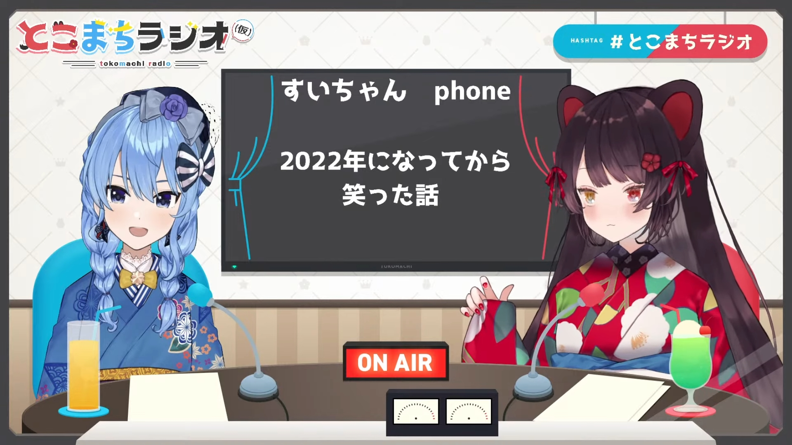

import Fa from '@site/src/components/fa'
import YTTime from '@site/src/components/YTTime'
import YTLink from '@site/src/components/YTLink'
import SNSIcon from '@site/src/components/SNSIcon'
import Date from '@site/src/components/date'

# Episode 14

<Date D="2022-01-26" />

> <YTLink Id="a4GYz0rcqyM" />

## Intro Talk

Suisei was on a 10-day-long vacation while Toko was just relieved from the rehearsal and preparations of NIJISANJI 4th Anniversary Fes (cancelled). Since filtering out the letters to be read was a burden too heavy for only of them them, plus there were too many topics between them for the past few months and for the New Year, they did not accept fan letters this time.

They got a totally full schedule in the past 2 months so they weren't able to hold their radio.

- [ <YTTime Id="a4GYz0rcqyM" Time="04:42" /> ] Suisei said she wanted to see Toko's performances on NIJISANJI 4th Anniversary Fes., since it was the first time they could perform in 3D uniforms and for most audiences, it was the first chance to see Toko's legs moving.
- [ <YTTime Id="a4GYz0rcqyM" Time="06:00" /> ] Toko put "Sui-chan phone" on stream, trying to explain why the sound quality was weird comparing to normal streams.
- [ <YTTime Id="a4GYz0rcqyM" Time="08:25" /> ] Suisei acting as if she was the Drive-Thru service. Toko ordered _French fries, as much as you have_. (It was Tokomachi's favorite food, but Japan was lack of potatoes and most fast food restaurants [<Fa name={[ 'solid' , 'newspaper' ]} /> stopped selling M and L size French fries](https://news.yahoo.co.jp/articles/2c585d808338d4b914458f790f3fec7ca11e008a) for a while.)

## Talks & Topics

- [ <YTTime Id="a4GYz0rcqyM" Time="10:21" /> ] Talking about this year wishes Suisei's wish was hoping her album could sell more, also she wanted to make extremely popular songs and go to NHK Kouhaku. [ <YTTime Id="a4GYz0rcqyM" Time="18:50" Desc="" /> ] Toko's wish was hoping she could sing more this year.
- [ <YTTime Id="a4GYz0rcqyM" Time="12:20" /> ] Toko was a little bit "unhappy" that Suisei have forgotten to give her the signed album while she already gave a lot others. Suisei realized she screwed up and promised her next time they go out for a meal, she would give Toko one signed copy in person.
- [ <YTTime Id="a4GYz0rcqyM" Time="15:14" /> ] Suisei was happy when she saw audiences with Toko's fan mark (:tropical_drink:) was also talking about they heard Suisei's song in TV Advertisement.
- [ <YTTime Id="a4GYz0rcqyM" Time="15:50" /> ] Suisei once asked what was the fan name of Toko's audiences. Toko answered _not decided_ and said it should be _Minna_. (It means _everybody_. In before it was _Kisamara_ or _Omaera_, more like _you guys_.)
- [ <YTTime Id="a4GYz0rcqyM" Time="17:40" /> ] Suisei said she like _Raindrops_ a lot and asked if Toko could arrange a collab. Toko said she was the gatekeeper of the underworld, not _Raindrops'_. They still, in the end, agreed on Tokomachi's event should come first.
- [ <YTTime Id="a4GYz0rcqyM" Time="20:00" /> ] Toko mentioned that Suisei often watched her stream of [<Fa name={[ 'brands' , 'steam' ]} /> Unpakcing](https://store.steampowered.com/app/1135690/Unpacking/) and was thinking _how would she arrange those things_ as if she was playing Tetris. Toko was also curious what was Suisei's way to unpack.
- [ <YTTime Id="a4GYz0rcqyM" Time="59:07" /> ] The best-buys of Suisei in 2022 was Gacha. Toko mentioned she also do gachas in [_THE iDOLM@STER CGSS_](https://en.wikipedia.org/wiki/The_Idolmaster_Cinderella_Girls:_Starlight_Stage) sometimes.

### Phony

> <YTTime Id="a4GYz0rcqyM" Time="22:05" Desc="Tokomachi talking about Phony" />

Suisei posted [<SNSIcon /> Phony](https://www.youtube.com/watch?v=N029UUlH1Dc) in her channel on Nov 26th, 2021. Toko then [<SNSIcon /> posted hers](https://www.youtube.com/watch?v=g_vV3bE3GNo) on 8th Dec. People thought Suisei singed it first, Toko was influenced and then followed. But Toko explained that she already done the recording and let Suisei listened to the vocal track during the overnight party in Suisei's apartment.

So it was Toko did the recording first, but Suisei finished it and posted earlier. It was a coincidence.

There were several pretty high quality fan-made Tokomachi version like [<SNSIcon /> this one](https://www.youtube.com/watch?v=Do6onbPJOGE) since they were using the same official instrumental and similar key.

### Komoro City

> <YTTime Id="a4GYz0rcqyM" Time="24:25" Desc="Visit Komoro City one day" />

From Oct 2021, Toko had a tie-up (collab) with the Komoro City, to promote the local scenic spots and it's famous autumn red leaves. [<SNSIcon /> Hatsukoi](https://www.youtube.com/watch?v=G7aJCz6E_YY) was the tie-up song for it. During the collab the promotion account of Komoro City picked up the slogan from a superchat said _Komoro Forever!_ and there were variants like _Tokomachi Foever_ appeared in the previous episodes. Toko also once called the mayor _big boss of Komoro_ and the [mayor accepted](https://twitter.com/komorojin/status/1451551560266248194) the title and also [<SNSIcon Name="twitter" /> invited Toko to visit the city](https://twitter.com/komorojin/status/1450737738416734210).

On [ <YTTime Id="a4GYz0rcqyM" Time="24:25" /> ] Toko mentioned that she still got no time to visit Komoro City. Suisei was also interested in the local apples, she also suggested that Toko could hold a mini live in Komoro City. Toko's new year wish was concluded by Suisei saying _Toko wanted to sing at Komoro City_.

### Where would they go together

> <YTTime Id="a4GYz0rcqyM" Time="25:53" Desc="Where would Tokomachi go together?" />

They synchronized and _Disneyland_ was their answer. Toko said she wanted to take a ride on _Beauty and the Beast_ with Suisei.

Suisei just heard about _Beauty and the Beast_ before she attended the Minecraft Disneyland collab. In the end she was nearly moved to tears and sent LINE message to Toko right after the collab ended, talking about how brilliant the design was.

They also mentioned they had went to a lot of places before, _e.g._ a Jinja (Japanese Shrine), an indoor park (with Anemachi) and rode jet-coaster together.

Suisei said she already went to Jinja already, but before that, she went to a very rural temple accidentally and was pretty worried if the gods in the Jinja would be jealous or angry. Toko suggested that maybe they should send a superchat as _offer money_ and ask [<SNSIcon /> Fumi](https://www.youtube.com/channel/UCwrjITPwG4q71HzihV2C7Nw) (NIJISANJI liver, said to be a god living in a Jinja) for the answer.

> <YTTime Id="a4GYz0rcqyM" Time="33:37" Desc="Still waiting for the chance to go out together" />

Toko mentioned that there were some time that pandemic was not that tense at the end of 2021 but unfortunately they had no time. They also had to cancel their plans due to the resurgence.

After Toko said _the thick the wall is, the happier when we came across that_, Suisei said _Eh, Romeo and Juliet?_ Toko suggested that she should do a _Voice-craking Romeo_ now, Suisei did so and her voice got cracked by auto noise cancellation.

### Funny Moments in 2022

> <YTTime Id="Ql5YkeQ6iDg" Time="34:30" Desc="Toko's side" />

Toko once asked Furen E Lustario, one of Toko's colleges, a math problem:

_To walk 30 kilometers long in 10 minutes, what's the demanded velocity (kilometers per hour)?_

Furen answered _Is it 3 (kilometers per hour)?_ Toko knew it was normal for Furen to being not that good at math and told Suisei about that. Suisei thought for a while and answered _It's 0.3!!!!!!!!!!_ confidently.

Suisei then admitted she's really not good at math and probably most things related to numbers.

> <YTTime Id="Ql5YkeQ6iDg" Time="40:00" Desc="Suisei's side" />

Suisei was on a vacation and secretly sneaked back to her parents' house. She said she had not been back for 2 years so she wanted to give her parents a surprise. She succeed and her mother cried out loud and laughed after that. Toko was surprised that Suisei's mother got such a reaction since she should had met Suisei for several times recently.

Suisei also mentioned that Toko might have nearly endless topics with her mother, both of them are talkative. They even might have some topics like _Ah I also want to live to over 100 years old like you do with my husband ~_

### New Challenges in 2022

> <YTTime Id="Ql5YkeQ6iDg" Time="45:06" Desc="Toko's side" />

Toko's was _English Learning_. She spotted a lot of English comments but she cannot communicate fluently and thought the non-Japanese audiences might have difficulties in understanding her talks. So Toko decided to learn some English this year.

Besides, Toko was also curious about the NIJISANJI EN members' topics. Toko watched their stream a lot but failed to understand the content.

Toko's other challenge was _more dancing_ since there are more live concerts to attend. She also mentioned that both Tokomachi had some difficulties when doing stretching before their dance classes.

> <YTTime Id="Ql5YkeQ6iDg" Time="50:20" Desc="Suisei's side" />

Suisei finally remembered what she was going to challenge this year. It's _music composition_. She seemed to have a strong will to write a song totally from herself (vocal, lyrics and music). But seemed like she had some problems in memo the melodies and ideas.

Toko said she was look forward to an all-Suisei song in the future.

Since the funniest moment of 2021 was _Suisei making grated radish_, Suisei said she would be willing to break the record.

### Too Busy

> <YTTime Id="a4GYz0rcqyM" Time="61:39" Desc="LINE and Discord" />

Toko said they were sending LINE text messages very often, but also had pretty long time not talking like this. On Toko's side, Suisei's chat was pretty active and can be always found around the third place. They often send each other messages when they noticed something, bought something, got something to do etc.

And since they haven't held Tokomachi Radio for a long time, Toko had some trouble finding Suisei's name on Discord before streaming. Suisei mentioned that they don't talk on Discord that much and mostly talk on LINE so it was fine.

> <YTTime Id="a4GYz0rcqyM" Time="63:15" Desc="It's been so long" />

Near the end of the stream Suisei noticed that it was nearly 3 months since last episode. She was also very happy to see people still sent a lot of replies to the tweet about the radio and got cheered up knowing they are finally going to hold the 14th episode.

They also started to confirm the schedule on stream to see if they can do the 15th episode in February.

## Navigation

・[Go back to Tokomachi Radio Season 2](/radio/tokomachi_radio_s2#episode-14)
