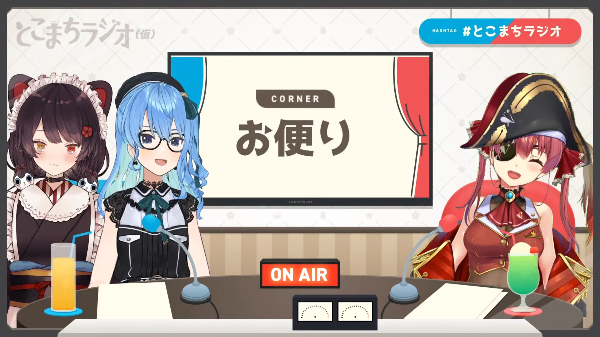
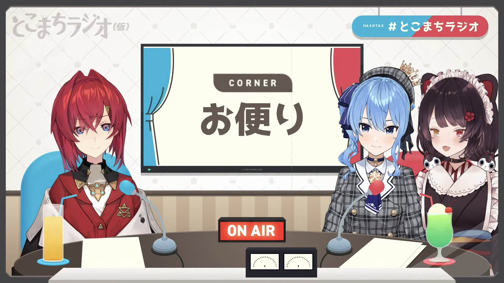

import Fa from '@site/src/components/fa'
import YTTime from '@site/src/components/YTTime'
import YTLink from '@site/src/components/YTLink'
import SNSIcon from '@site/src/components/SNSIcon'
import FYI from '@site/src/components/FYI'
import Date from '@site/src/components/date'

# Tokomachi Radio Season 1 (WIP)

:::tip Notice

The translation follows the English introduction page.

Ref: [<Fa name={[ 'solid' , 'play' ]} /> _hololive official website: OUT OF FRAME_](https://hololive.hololivepro.com/en/music/out-of-frame/)

According to Tokomachi themselves, (Temp) is considered to be part of the formal title now.

:::

:::info About the content

Most episodes were just chatting, only rather important or interesting topics would be picked out and recorded.

:::

**Full Title:** Tokomachi Radio (Temp)

The radio program was a variety show started by 2 girls chasing their dreams.

The first step was this radio program.

## Episode 01: The Start

<Date D="2020-10-28" />

The first episode, both of them still can't believe it came true. They said this was their first step towards their dreams.

Their dreams were

- Duo radio program
- Duo original songs
- Duo live concerts

They dreamed of singing and dancing together on Toyosu PIT. They succeed in that after a year on [<SNSIcon /> Suisei's 1st Solo Live](/topics/suisei_galaxy).

They received 300+ letters for their first episode and chose 4 to read.

Toko's conclusion of Suisei: _Singing, Tetris, Psychopath_.

Suisei's conclusion of Toko: _Singing, Night Fishing, Chatting_.

Somehow Tokomachi often got some trouble singing together, because Toko's highest key was way more lower than Suisei's lowest key. This affected their choice on songs singing together.

For them, _Ensemble Stars !!_ was their bible of _how to become an idol_ and their favorite line was _Only love does not make an idol, but without love you would never be an idol._

In the end they re-announced [Toko's 1st solo live](/topics/toko_who_i_am) and announced [their first cover MV](/timeline/2020#first-tokomachi-cover-mv).

---

## Episode 02

<Date D="2020-11-25" />

> <YTLink Id="ZONauvZUkEY" />

Suisei was extremely noisy from the beginning.

The beloved _Voice-cracking Romeo_ scene also came from this episode.

> <YTTime Id="ZONauvZUkEY" Time="25:08" Desc="Voice-cracking Romeo" /> (Please reduce the volume)

 
Translation

:comet: : OHHHHHHH JULIET!!!!!!! WHY YOU ARE JULIEEET?????????????

:tropical_drink: : (Laughing)

:comet: : JULIET PLEASE LET ME HEAR YOUR VOICE JULIET!!!

:tropical_drink: : (Laughing) Romeo, I, I cannot breath...

:comet: : WHY!!! HAVE YOU DRUNK THE POISON JULIET???

:tropical_drink: : I...I want...

:comet: : WHY!!! WHY JULIET!!!

:tropical_drink: : Let me speak Romeo...

:comet: : OH YOU CAN STILL TALK JULIET! TELL ME WHAT'S WRONG!

:tropical_drink: : There's only 2 seconds left.

---

Note: Romeo was supposed to stay low as possible every time he tried to meet Juliet secretly.

---

## Episode 03

> <YTLink Id="s6OPCzpCep4" />

They were in a event rush at that time. Especially Suisei had 5 lives to attend so they did this episode in a very casual pace.

They were very happy at people started EnSta after watching their performances on Toko's 1st solo live.

They mentioned that they spent a lot of time in the studio practising the dance steps. They also had to record their dance steps to confirm how were they doing before going to studio. So they got a full record from clumsy to masterly, which, they claimed to be a pretty precious memory.

---

## Episode 04

<Date D="2021-01-27" />

> <YTLink Id="Kr1jxq0ms00" />

This is the first episode in 2021 so there were a lot of talks about the new year plans.

> <YTTime Id="VH0XOn6ceSA" Time="04:42" Desc="Confirmation" />

Toko and Suisei got a special way to confirm that each other is awake before going out to play together.

 
Tokomachi's way

:tropical_drink: : RISKY VENUS!

:comet: : HEY!

> <YTTime Id="VH0XOn6ceSA" Time="22:47" Desc="What is idol?" />

One of the fan letters asked Tokomachi "What is idol?" and they thought a long time.

The final answer was pretty unexpected.

 
Tokomachi's answer

:comet: : Everyone that shines bright!

:tropical_drink: : Hoshimachi Suisei.

---

## Episode 05: with Houshou Marine

<Date D="2021-02-24" />

:::note

The content would be more focused on Tokomachi.

:::

> <YTLink Id="5JpC8ec5dfw" />

This was the first time having a guest on air with them. Since there were only 2 chairs, Suisei had to sit with Toko.

The reason inviting [<SNSIcon /> Houshou Marine](https://www.youtube.com/channel/UCCzUftO8KOVkV4wQG1vkUvg) (aka Sennchou) was pretty simple: Among all hololive members, she's interested in Marine most. While being pretty familiar with Suisei, Marine tried to start the talk with Toko by talking some NSFW talks (in Marine's word, _horny_ topics), Toko reacted to those with a indifferent reaction.

Both Toko and Suisei had to do something to stop Marine from talking NSFW topics in the stream.

Since Suisei's hair color was similar with Lize Helesta, Marine's was similar with Ange Katerina, `Toko + Suisei + Marine` was also considered _Sanbaka Alter_ to some extent.

### Timestamps

- [ <YTTime Id='5JpC8ec5dfw' Time='13:51' Desc='' /> ] According to Suisei, Toko can be categorized as S (Sadistic).
- [ <YTTime Id='5JpC8ec5dfw' Time='28:49' Desc='' /> ] Suisei didn't know what _outlying island_ was, same did Marine. Suisei even said _Is Japan an outlying island?_ Toko was so amused, she laughed a lot and said _Are you two idiots_.
- [ <YTTime Id='5JpC8ec5dfw' Time='46:42' Desc='' /> ] In the last short drama, Suisei was the prince, Marine was the Demon and Toko was the princess. Marine tried hard to stop Suisei to save Toko and the "fight" was pretty fierce. In the end Toko suddenly said _But I would marry the prince!_ and Marine, the Demon was so said and left quitely.

---

## Episode 06: with Ange Katerina

<Date D="2021-03-25" />

:::note

The content would be more focused on Tokomachi.

:::

> <YTLink Id="nlkJdUZU5Ws" />

For Episode 6, they invited [<SNSIcon /> Ange Katerina](https://www.youtube.com/channel/UCHVXbQzkl3rDfsXWo8xi2qw) as the guest. Suisei had met Ange during Toko's 1st solo live preparations and rehearsals.

It was considered _Sanabaka Alter (mini)_ this time (Suisei ≒ Lize).

### Timestamps

- [ <YTTime Id='nlkJdUZU5Ws' Time='03:20' Desc='' /> ] Toko mentioned Suisei's change in her voice on 22th March, her 3rd Anniversary. Suisei said she was so nervous and worried about that, also consulted Toko for a long time, but it turned out that her audiences accepted it pretty flawlessly.
- [ <YTTime Id='nlkJdUZU5Ws' Time='09:15' Desc='' /> ] Suisei made up some scenes that never happened like they talked a lot, went together for meal or went to Karaoke together etc. which made Ange felt shy and Toko was so amused that she cannot help laughing. Toko even pretended to be jealousy when Suisei said _Hey we also went to the hotel for a girls' talk_.
- [ <YTTime Id='nlkJdUZU5Ws' Time='10:51' Desc='' /> ] Suisei said she once had an overnight party in a hotel.
- [ <YTTime Id='nlkJdUZU5Ws' Time='14:33' Desc='' /> ] Toko mentioned that during her 1st solo live, the green room was separated, but still Suisei went to NIJISANJI's green room often and played with the others. Suisei also claimed _I'm also one of NIJISANJI, for today only_.
- [ <YTTime Id='nlkJdUZU5Ws' Time='17:17' Desc='' /> ] Suisei said she was confused when she first saw Ange's debut stream, wondering what was Ange's actual gender. The answer made Toko laughed from the beginning to the end and said _I can't believe you were bothered by this for so long!_
- [ <YTTime Id='nlkJdUZU5Ws' Time='21:19' Desc='' /> ] Ange thought Suisei's interactions with Toko was pretty funny, they always kept talking.
- [ <YTTime Id='nlkJdUZU5Ws' Time='22:55' Desc='' /> ] Toko mentioned their ways to laugh started to exchange. Suisei often Aha↑ loudly in the street of Tokyo and Toko started to laugh in a more "modest" way.

### Katerina Family

One of the fan letters asked what position they would be if they were family members.

Suisei and Toko immediately answered and agreed that they should be **twin sisters**.

And Ange should be the **father** spoiling the daughters, while Lize should be the strict **mother**. Ange herself also agreed on this and Toko even imitated what Lize might say when Ange try to spoil the daughters.

 
Imaginary Angry Lize Mama 💢

:crown: : Ange why do you always leave this kind of things to me!

:crown: : You never tell them it's wrong and that's why it's always happening!

:scales: : B, But I don't want to be hated by them...

Toko and Suisei then act as if they were the baby daughters and Ange cannot resist the temptation to spoil them.

---

## Episode 07: Off Collab

<Date D="2021-04-30" />

> <YTLink Id="kR9mSvUyfkY" />

This was a special episode having Toko streaming with Suisei together at Suisei's apartment. Tokomachi both had their Live2D avatar activated.

#### Major Topics

The major topic was about Suisei's 3rd Anniversary Live "SPACE for Virtual GHOST".

<FYI Topic="SPACE for Virtual GHOST" Desc="/topics/suisei_ghost#tokomachi-side" />

#### Other Topics

The best songs for them were _Ensemble Stars_ songs.

If they are going to have a band, Suisei would be the pianist and Toko would play [<Fa name={[ 'brands' , 'wikipedia-w' ]} /> Shakuhachi](https://en.wikipedia.org/wiki/Shakuhachi).

If they can only eat one kind of food for a year, they choose to eat fried chicken or potato chips.

About the childhood dream job. Suisei's was idol singer and Toko's was Cerberus.

They both lie about their jobs to the barbers.

---

## Episode 08

<Date D='2021-05-28' />

> <YTLink Id="8sqE4VgaT0w" />

Another beloved scene, _Suisei making grated radish_ came from this episode.

> <YTTime Id='8sqE4VgaT0w' Time='07:13' Desc='Suisei making grated radish' />

This happened during Toko's stay at Suisei for an overnight party. Suisei was making dinner for Toko and grated radish was one of both Toko and Suisei's favorite dish. But her movements were so exaggerated and funny, her full body and her hair was shaking fiercely as if there was an earthquake.

Toko was amused by this at first glance and took a video of this.

There was an official animated clip for this in [Episode 13](/radio/tokomachi_radio_s1#episode-13).

Other topics:

- [ <YTTime Id='8sqE4VgaT0w' Time='11:08' Desc='' /> ] They do share dishes when going out for meal, but only those acceptable ones (e.g. french fries). They still tend to order different dishes.
- [ <YTTime Id='8sqE4VgaT0w' Time='18:29' Desc='' /> ] They both tend to sleep or staying at home relaxed during heavy rain days (unless there's work).

## Episode 09

> <YTLink Id="RrX2uuMeAW8" />

## Episode 10

> <YTLink Id="pT5uYMHtmL0" />

## Episode 11

> <YTLink Id="B3ZDoOxQjnA" />

## Episode 12

> <YTLink Id="21ELJRyo-xI" />

## Episode 13: 1st Anniversary

<Date D="2021-10-31" />

> <YTLink Id="Ql5YkeQ6iDg" />
