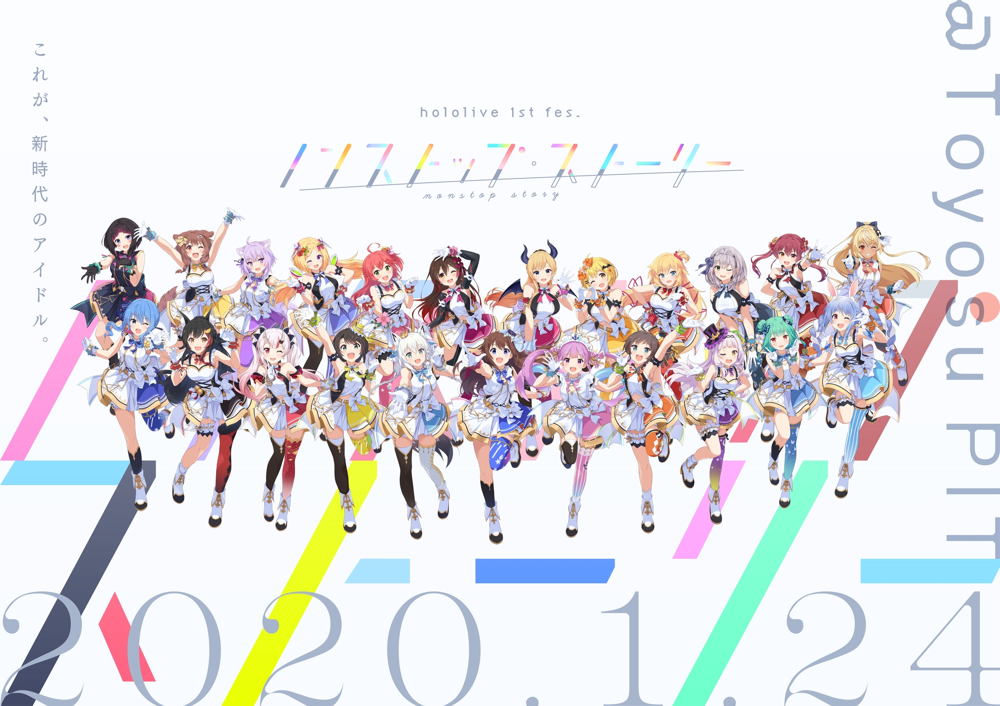
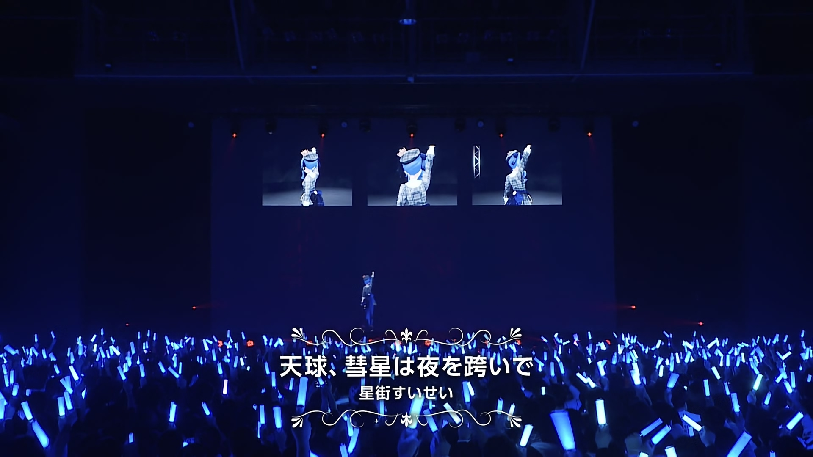

---
---

import Fa from "@site/src/components/fa";

# Tokomachi in 2019

## First Tweet Contact

### 2019-05-19

On May 19th, 2019, Hoshimachi Suisei announced that she would graduate from indie and join hololive's new project "INNK MUSIC".

The first ever Tweet contact was Toko congratulating Suisei for entering INNK, hoping her songs can reach out to the whole world.

> [<Fa name={[ 'brands' , 'twitter' ]} /> Original Tweet](https://twitter.com/suisei_hosimati/status/1130054368886050816)

 
Tweet Translation

 

## Casual Tweet

### 2019-05-21

Toko reached 60k subscribers and Suisei congratulated her on this.

They "kissed" a lot.

> [<Fa name={[ 'brands' , 'twitter' ]} /> Original Tweet](https://twitter.com/suisei_hosimati/status/1130814178250317825)

 
Tweet Translation

 

 

Note:

- The "signing" context is blurry but could be related to Ensemble Stars events.
- "3 of us" probably refers to [<Fa name={[ 'brands' , 'youtube' ]} /> Hiro Minamori (graduated)](https://www.youtube.com/channel/UCuGMkxJA_icuiF01u8f3Y2Q)

### 2019-06-07

Hoshimachi Suisei got the 8th place on Daily trending (2019-06-07), tweeted by Tsuranimizu (Her manager in INNK MUSIC).

Toko replied and they again "kissed" a lot.

> [<Fa name={[ 'brands' , 'twitter' ]} /> Original Tweet](https://twitter.com/suisei_hosimati/status/1136678053243834370)

 
Tweet Translation

 

 

### 2019-06-08

Suisei reached 11,111 YouTube Channel sub, Toko congratulated her.

They also mentioned they want to sing together on live stage one day.

They realized their dream on Dec 10th, 2020 [<Fa name={[ 'solid' , 'music' ]} /> Inui Toko 1st solo live "who i am"](/docs/topics/toko_who_i_am).

> [<Fa name={[ 'brands' , 'twitter' ]} /> Original Tweet](https://twitter.com/suisei_hosimati/status/1137100337465085952)

 
Tweet Translation

 

 

 

 

 

 

## The birth of TOKOMACHI

### 2019-06-26

The first time the unit name Tokomachi (とこまち) appeared is on the Minecraft collab.

This is also the first ever collab of Tokomachi.

> [<Fa name={[ 'brands' , 'youtube' ]} /> Original YouTube Stream](https://youtu.be/Kr1jxq0ms00)

The naming logic is:

  Inui Toko +
  Hoshi
  
    machi{" "}
  
  Suisei = Toko
  
    machi
  

:::info Funny Episodes
[13:38](https://youtu.be/Kr1jxq0ms00&t=818s) Suisei and Toko were amused when seeing a wolf (dog) trying to get its fur dry

[14:23](https://youtu.be/Kr1jxq0ms00&t=863s) Suisei asked Toko to do the same and Toko followed. Toko actually doesn't like being called a _dog_ but she still followed.

[50:25](https://youtu.be/Kr1jxq0ms00&t=3025s) Tokomachi Opera
:::

## 20k Sub Tweet

### 2019-07-25

Suisei reached 20k sub and it was her goal for 2019.

Toko congratulated and mentioned they want to dance in full 3D one day.

> [<Fa name={[ 'brands' , 'twitter' ]} /> Original Tweet](https://twitter.com/suisei_hosimati/status/1154679477605036034)

 
Tweet Translation

 

 

## Turning Point

### Virtual to Live 2019

Full event name [Virtual to LIVE in 両国国技館 2019](https://event.nijisanji.app/vtlryougoku2019/)

This was the first time for Inui Toko to attend a full 3D live, where she sang Chiisaki Mono (小さきもの).

According to Suisei's YouTube after talk stream (privated), Suisei watched the whole live and was astonished by Toko's performance.

### Non-Stop Story

Full event name [hololive 1st fes. ノンストップ・ストーリー](https://www.nonstop.hololive.tv/)

This was the major turning point for Suisei.

Her original plan was to sing [<Fa name={[ 'solid' , 'meteor' ]} /> _Comet_](https://youtu.be/3cqV5BKJHyk) there. But after seeing Toko's live performance, she changed her mind and went for more _impact_, thus the song she chose to sing on stage was [<Fa name={[ 'solid' , 'meteor' ]} /> _Tenkyuu, Suisei wa Yoru wo Mataide_](https://youtu.be/zLak0dxBKpM). The song and her performance was so impressive that her name was on Twitter Trend for a pretty long time.

She gained popularity after the event rapidly and started trending.

### Toko's Response

 

> [<Fa name={[ 'brands' , 'youtube' ]} /> Original YouTube Stream](https://youtu.be/CJD2mkpSkJs&t=4119s)

According to Toko, the most impressive part was Suisei's [<Fa name={[ 'solid' , 'meteor' ]} /> _Tenkyuu, Suisei wa Yoru wo Mataide_](https://youtu.be/zLak0dxBKpM) and she was so moved that she cried. She said she became Suisei's fan girl and send LINE messages to Suisei right after watching the live.

Toko was also very happy to know her performance inspired Suisei.

:::info Toko's impressions on Suisei

- Good at singing
- She never gives up or compromises on what she aimed for
- I admire her a lot

:::

Suisei appeared in the stream chat later when Toko was talking about Ensemble Stars. Toko said _Hoshimachi! Sui-chan! Here comes our beloved singer_ and was pretty shy and unsure whether Suisei heard her praising Suisei's performance.

> [<Fa name={[ 'brands' , 'youtube' ]} /> Original YouTube Stream](https://youtu.be/CJD2mkpSkJs?t=5810)

 
Talks

:comet: : You praised my performance? I will check the archive later!

:tropical_drink: : OK I will cut that part.

:tropical_drink: : Oh wait don't go, I still got something about EnSta to tell you!

(Talking about EnSta)

:comet: : Tell me more on LINE!

Really close friends right?

## Summary of 2019

Suisei and Toko knew each other in 2019 and they were already pretty close friends by then.

They started the unit Tokomachi on 2019-06-26.

Toko's performance inspired Suisei, and Suisei's performance on Non-Stop Story became her major turning point. That could be the reason why they cherish each other a lot.
