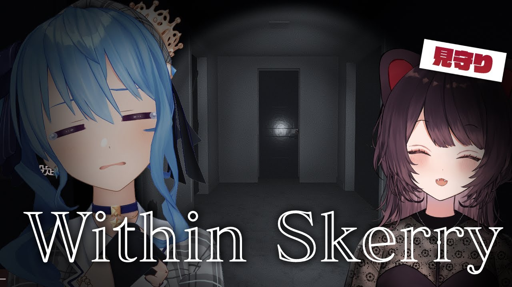

import Fa from '@site/src/components/fa'
import YTTime from '@site/src/components/YTTime'
import YTLink from '@site/src/components/YTLink'
import SNSIcon from '@site/src/components/SNSIcon'
import FYI from '@site/src/components/FYI'
import Date from '@site/src/components/date'

# Tokomachi in 2022 (WIP)

:::warning Warning

This page is being actively edited.

:::

## Tokomachi Radio

<Date D="2022-01-26" />

Episode 14 came after a 2-month-long gap and people were waiting anxiously for this.

<FYI Topic="Tokomachi Radio Episode 14" Desc="/radio/tokomachi_radio_s2#episode-14" />

## Game collab: Within Skerry

<Date D="2022-03-21" />

It has been another 2 months since last episode of Tokomachi Radio. The chat asked if there would be another episode this month, Suisei [got pretty nervous](https://youtu.be/yydLvFXNKtg?t=5170) and said there might not be an episode available since the scheduling problem (they got 3 lives in 2 weeks in total), but they might come up with a game collab recently.

Suisei also promoted for Sanbaka's Birthday Live which was held on 26th March. and said again about the wish that both of them had been holding: They still wish to work for more cross-agency works.

<Date D="2022-04-06" />

> <YTLink Id="rkOfEICgZRg" />

Suisei and Toko chose [<Fa name={[ 'brands' , 'steam' ]} /> Within Skerry](https://store.steampowered.com/app/1871510/Within_Skerry/) for their rare game collab.

The last game collab was the [Minecraft night fishing](/timeline/2020#new-year-) back to 30th Dec. 2020.
