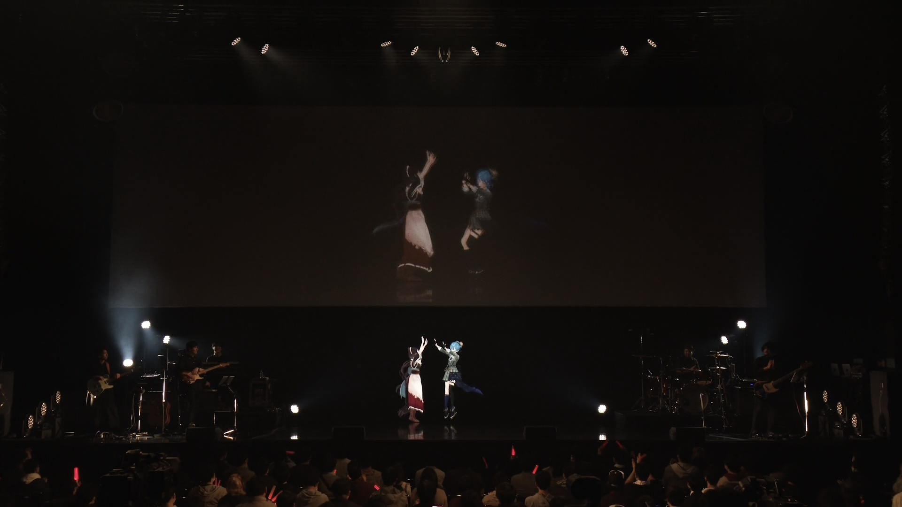

import Fa from '@site/src/components/fa'
import YTTime from '@site/src/components/YTTime'
import YTLink from '@site/src/components/YTLink'
import FYI from '@site/src/components/FYI'
import Date from '@site/src/components/date'

# who i am

:::caution Paid Event

This is a paid live, originally streamed on Niconico. If you are interested in their performances, you can purchase _Blu-ray Disc_ from [<Fa name={[ 'solid' , 'compact-disc' ]} /> NIJISANJI Shop](https://shop.nijisanji.jp/s/niji/item/detail/NJSJ-026).

:::

The live was held on Dec. 10, 2020 in KT Zepp Yokohama.

Suisei and Toko finally fulfilled [their dreams back in 2019](/timeline/2019#2019-06-08).

## Setlist

Suisei appeared on stage as the second guest, singed 2 songs with Toko.

- BREAKTHROUGH / Trickstar (Ensemble Stars!!)
- Tsubasa Moratorium / ALKALOID (Ensemble Stars!!)

## MC

Suisei was very excited seeing the live guests since she had been on virtual live stages.

MC1:

- Suisei was not affiliated to NIJISANJI.
- They bought the same size of water (different from normal), fried chicken and meat steamed buns without discussion.
- There might be already soul-level connections between them.
- They started to exchange their ways of laughing, Toko started to laugh in Suisei did and Suisei did an "Aha↑" before in the street.
- Toko was feeling shy when saying "Toko-chan is cute today" because she was already over 200 years.
- Toko did gacha for Suisei and got the target character.

MC2:

- Toko was exhausted after singing and dancing with Suisei for 2 songs.
- Toko admitted that she was over 200 years old while Suisei was eternal 18 years old.
- They thought it would be great to dance while singing, but they got no professional dancing tutor so they have to watch the MV over and over again to remember the dance step which cost them a long long time.

## Official After Talk

:::caution Paid Event

This was a partially paywalled stream on NIJISANJI Niconico Fanclub.

:::

Toko talking about Suisei:

- Toko spent most time before live practising with Suisei, even longer than Lize or Ange.
- Toko and Suisei chose the songs they actually singed before in Karaoke.

## Suisei's After Talk

> <YTLink Id="Ra2rHH9zXW0&t=285s" />

- Toko and Suisei were not sure about if they can sing EnSta songs there, but it turned out to be solved.
- It was the first time she met Higuchi Kaede, Ange Katerina, Lize Helesta and Rindou Mikoto for the first time.
- Suisei was pretty nervous and rather quite when she met them for the first time.
- Mikoto-sama asked if Suisei can teach her playing Tetris.
- Suisei was very worried whether she can get up on time.
- Suisei made some really loud noises during gacha in her own green room that made Kaede thought _was there anything wrong?_

> <YTTime Id="Ra2rHH9zXW0" Time="21:15" Desc="Gacha time!" />

Suisei mentioned that she invited Toko along with all other guests to do the gacha for her before the live started.

 
The gacha result

|    Member     | :star:5 | Target |
| :-----------: | :-----: | :----: |
| Lize Helesta  |    0    |   No   |
| Ange Katerina |    2    |   No   |
| Higuchi Kaede |  :zzz:  | :zzz:  |
| Rindou Mikoto |    1    |   No   |
|   Inui Toko   |    1    |  Yes   |

\* Higuchi Kaede was asleep in the other room that time.

Only Toko got the targeted character, maybe that's the power of the live concert heroine and the _mighty mighty_ Cerberus.

## Toko's After talk

> <YTTime Id="i8UbpU6wf1U" Time="06:47" Desc="Detailed backstage stories" />

Toko also talked about Suisei

- Toko knew it would be difficult to invite Suisei since they are affiliated to different agencies.
- Toko didn't give up on inviting Suisei and she did it. This might be the part influenced by Suisei.
- Toko thought Suisei is a very good friend, she also admire Suisei a lot.
- For Toko, Suisei is the idol and the artist. She always hoped she could sing beside Suisei one day.
- Suisei accepted Toko's invitation without any hesitation.
- Said again she spent most time practising with Suisei, they stay in the studio for hours.
- It was pretty rare that Suisei let Toko felt the same amount of passion to sing and dance together.

## Blu-ray Disc

> <YTTime Id="pT5uYMHtmL0" Time="05:23" Desc="Blu-ray Disc Talks" />

The Blu-ray version of the live concert finally came out in July, along with commentary track having Suisei / Higuchi Kaede as the guest chatting with Toko for the first half.

Their memories were mostly about the training of the dance steps.

Kaede also said she was like the grandma watching two granddaughters playing around.
