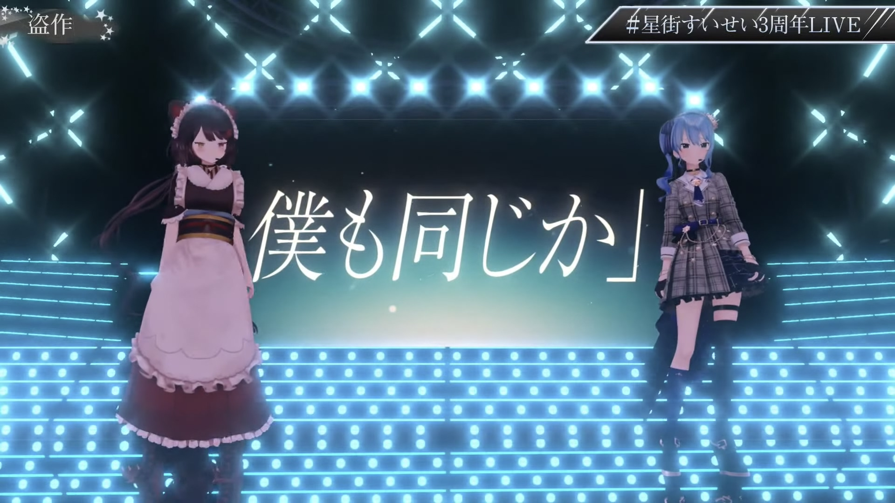
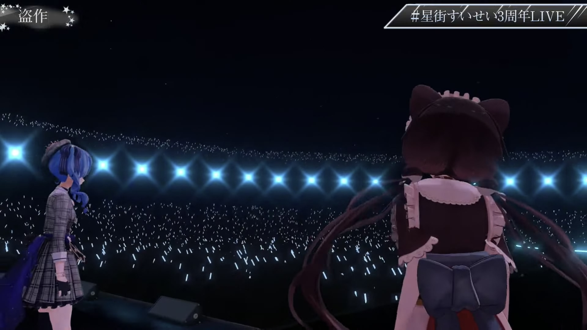

import Fa from '@site/src/components/fa'

# "SPACE for Virtual GHOST"

> [<Fa name={[ 'brands' , 'youtube' ]} /> Timestamp: Toko's part](https://youtu.be/Ajwv4ANSSg0&t=770s)

This was Hoshimachi Suisei's 3rd Anniversary YouTube Live.

Held on April 13th, 2021.

This was also the first time Tokomachi singing on a free / YouTube live.

## Setlist

Toko appeared on stage as the first guest, singed 2 songs with Suisei.

- In the Morning / Mrs. GREEN APPLE
- Plagiarism / Yorushika

## Surprise

Both Toko and Suisei said nothing before the live convert. Toko even tweeted to pretend as if she didn't know anything about the live and date.

> [<Fa name={[ 'brands' , 'twitter' ]} /> Original Tweet 1](https://twitter.com/inui_toko/status/1381846290212954113) , [<Fa name={[ 'brands' , 'twitter' ]} /> Original Tweet 2](https://twitter.com/inui_toko/status/1381848262760538112)

 
Tweet Translation

 

But still some lead indicated that Toko might already waiting at the backstage.

- Suisei asked if Toko wants some pizza.
- Toko followed the members of AIRS (Natsuiro Matsuri, Omaru Polka, Aki Rosenthal, Tokoyami Towa)

Toko once invited Suisei to her live concert (see also: _[<Fa name={[ 'solid' , 'microphone-lines' ]} /> Topics: "who i am"](/topics/toko_who_i_am)_ ) and according to Suisei, she wanted to invite Toko to her live concert in return and she did.

The live audience count jumped from about 46,000 (20:12 JST) to more than 56,000 (20:22 JST).

The numbers came from [<Fa name={[ 'solid' , 'play' ]} /> HoloStats](https://holo.poi.cat/stream/Ajwv4ANSSg0).

## After Talk

### Toko's Side

> [<Fa name={[ 'brands' , 'youtube' ]} /> Toko's Aftertalk](https://www.youtube.com/watch?v=BNq4LHZRhfQ)

Toko started her zatsudan after Suisei's live ended. The simple thumbnail said _I was still excited._ and the title said _(The live) was so wonderful..._

The audiences told her it was such a surprise. But Toko made it clear that she would not talk too much about the live itself since this was Suisei's day, it's her live so the heroine is Suisei.

She talked a little bit about interesting topics in the backstage instead.

#### O'zaku

It seemed like hololive's staffs knew clearly about Toko's snack preferences. They put several bags of potato chips, to be specific it was Toko's favorite [<Fa name={[ 'solid' , 'store' ]} /> O'zaku](https://housefoods.jp/products/catalog/cat_1,snack,pdt,oz.html) in her green room which let her felt a little bit surprised but also happy. But unfortunately she had no time for snacks so she took it back.

#### Suisei Pizza

Toko said it might be the only lead indicating that she might be the guest should be the pizza talk on the day before the live.

 
About the Pizza

 

 

 

According to Toko, she was there for the final rehearsal too. She didn't intend to imply anything but only thought _Oh pizza, I also want some..._ so she had that conversation with Suisei.

After a short while someone knocked the door and Toko thought it might be staff calling her. But when she opened the door and saw Suisei brought the pizza to her and said _Sorry for the wait, here's your pizza!_ as if it was the delivery service.

#### Home vs Away

It was like Suisei during Toko's 1st solo live preparation, Toko was playing away this time. The other guests were pretty funny and she was also treated warmly as if she was one of hololive members.

### Tokomachi Side

> [<Fa name={[ 'brands' , 'youtube' ]} /> Tokomachi Radio #7](https://youtu.be/kR9mSvUyfkY)

#### Choosing the Songs

Toko and Suisei said they decided what to sing pretty fast.

Mrs. GREEN APPLE was one of Toko's favorite singers and Yorushika's songs were the best choice considering the highest key Toko can reach.

Suisei also said she was the same type as Toko, they tend to have better conditions when singing on stage. They even got some synchronized movements on stage without any rehearsals.

#### Backstage

Suisei and Toko always talking in the backstage. They even forgot to turn their mic off and Polka heard that. Polka's reaction was _Oh, uh, both of you are pretty interesting._

#### Toko's Thoughts

Toko mentioned that she was so moved when seeing Suisei singing on the stage. She had to prevent herself from crying since it would affect her performance.

So she decided to think of some Suisei's very very embarrassing moments, according to Toko these were too embarrassing that she cannot say it publicly. Seeing the shining idol singing and dancing on stage and thinking of those, Toko felt a little bit _gap moe_.

Suisei asked _What are these? What have I done??_ and Toko said _It's a secret._

In the end they also did a shout-out that they want to do duo live concert.

## Related posts

・ [<Fa name={[ 'solid' , 'calendar-days' ]} /> _Timeline: Tokomachi in 2021_](/timeline/2021#space-for-virtual-ghost) &nbsp; <Fa name={[ 'solid' , 'arrow-right-from-bracket' ]} />

・ [<Fa name={[ 'solid' , 'microphone-lines' ]} /> _Topics: Tokomachi Music_](/topics/music_list) &nbsp; <Fa name={[ 'solid' , 'arrow-right-from-bracket' ]} />
