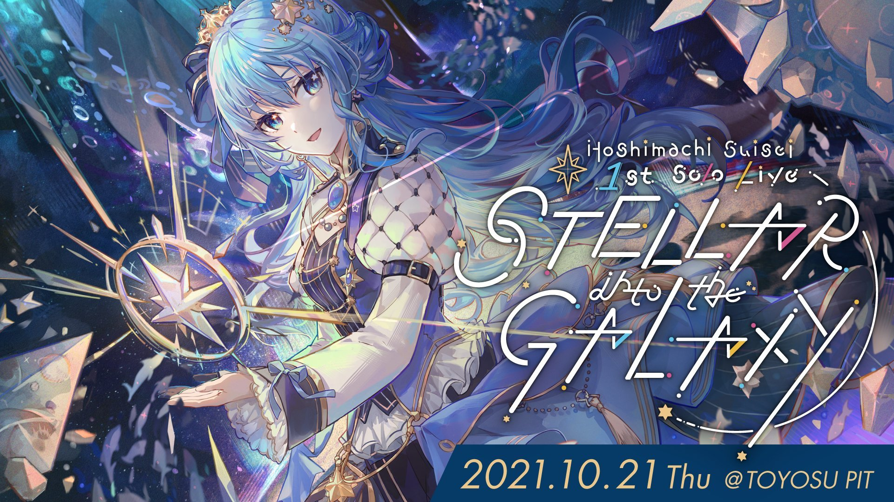
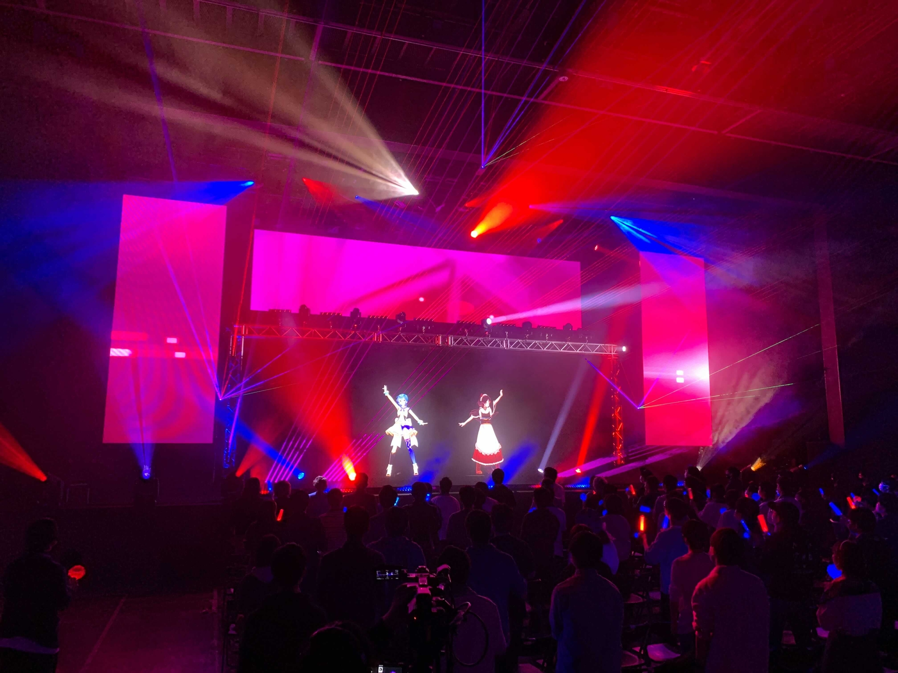
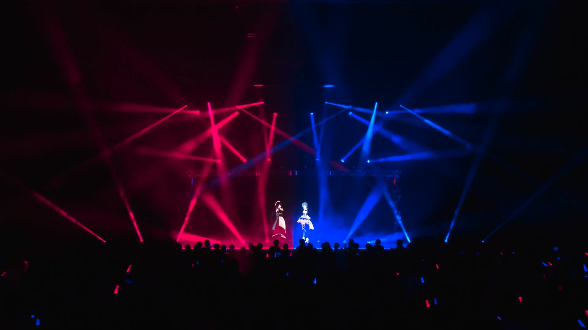

import Fa from '@site/src/components/fa'
import YTTime from '@site/src/components/YTTime'
import YTLink from '@site/src/components/YTLink'
import SNSIcon from '@site/src/components/SNSIcon'
import FYI from '@site/src/components/FYI'
import Date from '@site/src/components/date'

# STELLAR into the GALAXY

:::caution Paid Event

This is a paid live, originally streamed on SPWN.

If you are interested in their performances, you can purchase _Blu-ray Disc_ (Not available yet).

:::

**Full Title:** _Hoshimachi Suisei 1st Solo Live “STELLAR into the GALAXY” Supported By Bushiroad_

This was the 1st solo live of Hoshimachi Suisei, held on Oct. 21st, 2021.

Suisei invited Inui Toko and AZKi as guests.

## Setlist

- Galaxy Desitiny, Switch (Ensemble Stars !!)
- **OUT OF FRAME, Hoshimachi Suisei & Inui Toko**

_OUT OF FRAME_ was the first Tokomachi original song.

## After Talk

### Reason Inviting Toko

> <YTTime Id="d95pYGLpgXE" Time="45:05" Desc="Guest announcement" />

Suisei announced the guests for her 1st solo live and according to her, both of them are really important to her.

AZKi, the other VTuber / singer affliated to INNK Music, Suisei's colleage. She represents the **Past** of Suisei.

Toko, Suisei's friend, her close partener in music, affliated to NIJISANJI. She represents the **Future** of Suisei.

It was the third time Suisei and Toko singing and dancing together on same live stage.

Suisei said clearly that she would like to forge her future with Toko. Suisei would also break the walls between agencies, even the barriers between Virtual and the Reality. It's the _BREAKTHROUGH_ she had been longing for.

> [<SNSIcon Name="twitter" /> Original Tweet 1](https://twitter.com/inui_toko/status/1436300024401436673) , [<SNSIcon Name="twitter" /> Original Tweet 2](https://twitter.com/suisei_hosimati/status/1436303328741265410)

 
Tweet Translation

 

 

### Preparations and Performances

> <YTTime Id="9G6I4EQT3G8" Time="17:21" Desc="Suisei's after talk about guests" />

> <YTTime Id="Ql5YkeQ6iDg" Time="04:31" Desc="Tokomachi talking on radio" />

Both Suisei and Toko said few after the live and according to Suisei, she already said too much during the MC part.

Suisei and Toko mentioned they got 2 professional dancers backing them up. Especially [<SNSIcon Name="twitter" /> Araki Yuka](https://twitter.com/araki__yuka), she worked for the live concerts of Kizuna Ai, Hatsune Miku, even LiSA. So Tokomachi won't have to imitate the origianl MV or design their own dance steps from ground zero. The other dancer was [<SNSIcon Name="twitter" /> Mai Itamoto](https://twitter.com/mai_dance_mai).

Suisei also mentioned that comparing to spending hours during "who i am", they spent less time in dance rehearsal this time. They attended the dance lesson for 3 times and rehearsaled for 6 times in total.

The dance steps were designed to not strictly synchronize with each other, but it made Tokomachi's performances even more attractive, especially the pose and light works in the end, it perfectly matched the cover arkwork of _OUT OF FRAME_.

No further information about _OUT OF FRAME_ were provided so far.
